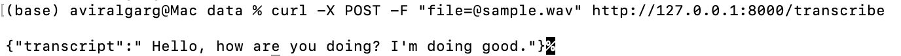
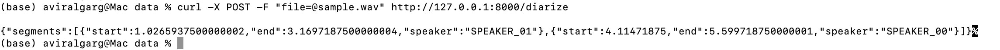
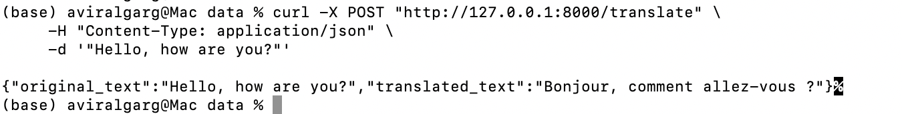

# Voice Text AI Demo

A dockerized FastAPI web application that provides audio processing capabilities including speech transcription, speaker diarization, text translation, and sentiment analysis.

## Features

- **Speech Transcription**: Convert audio files to text using OpenAI's Whisper model
- **Speaker Diarization**: Identify different speakers in an audio file (requires HuggingFace authentication token)
- **Text Translation**: Translate English text to French using the Helsinki-NLP model
- **Sentiment Analysis**: Analyze the sentiment of text or transcribed audio to detect emotional tone

## Demo Screenshots

The `data` folder contains demonstration screenshots and examples:
- **`transcribe_demo.png`**: Shows the speech-to-text transcription feature
- **`diarize_high_mem_demo.png`**: Shows the speaker diarization feature
- **`translate_demo.png`**: Shows the text translation feature

## Requirements

- **Python 3.11+**
- **FFmpeg**
- **Docker** (optional, for containerized deployment)

## Installation

### Local Setup

1. Clone the repository
2. Create a virtual environment:
   ```
   python -m venv venv
   source venv/bin/activate  # On Windows: venv\Scripts\activate
   ```
3. Install dependencies:
   ```
   pip install -r requirements.txt
   ```

### Docker Setup

Build and run the Docker container:
```
docker build -t voice-text-ai-demo .
docker run -p 8000:8000 -e HF_AUTH_TOKEN=your_token voice-text-ai-demo
```

## Environment Variables

- **`LOW_MEMORY`**: Set to "true" to disable memory-intensive features (default: "false")
- **`HF_AUTH_TOKEN`**: HuggingFace authentication token required for speaker diarization

## API Endpoints

- **`GET /`**: Health check endpoint
- **`POST /transcribe`**: Transcribe audio file to text
- **`POST /diarize`**: Identify different speakers in an audio file
- **`POST /translate`**: Translate English text to French
- **`POST /analyze-sentiment`**: Analyze the sentiment of provided text
- **`POST /transcribe-with-sentiment`**: Transcribe audio and analyze sentiment in one step

## Usage Examples

### Transcribe Audio

#### Endpoint: `/transcribe`

#### Request:
```bash
curl -X POST "http://localhost:8000/transcribe" \
  -H "accept: application/json" \
  -H "Content-Type: multipart/form-data" \
  -F "file=@sample.wav"
```

#### Response:
```json
{
  "transcript": "Hello, how are you doing? I'm doing good."
}
```

#### Local Testing:


### Diarize Audio

#### Endpoint: `/diarize`

#### Request:
```bash
curl -X POST "http://localhost:8000/diarize" \
  -H "accept: application/json" \
  -H "Content-Type: multipart/form-data" \
  -F "file=@sample.wav"
```

#### Response:
```json
{
  "segments": [
    {
      "start": 1.0435837020000002,
      "end": 3.4971879260000004,
      "speaker": "SPEAKER_00",
      "start": 3.4971879260000004,
      "end": 5.797107238,
      "speaker": "SPEAKER_01"
    }
  ]
}
```

#### Local Testing:


### Translate Text

#### Endpoint: `/translate`

#### Request:
```bash
curl -X POST "http://localhost:8000/translate" \
  -H "accept: application/json" \
  -H "Content-Type: application/json" \
  -d '{"text": "Hello, how are you?"}'
```

#### Response:
```json
{
  "original_text": "Hello, how are you?",
  "translated_text": "Bonjour, comment allez-vous ?"
}
```

#### Local Testing:


### Analyze Sentiment

#### Endpoint: `/analyze-sentiment`

#### Request:
```bash
curl -X POST "http://localhost:8000/analyze-sentiment" \
  -H "accept: application/json" \
  -H "Content-Type: application/json" \
  -d '{"text": "I am extremely happy with the service provided. The team was professional and efficient."}'
```

#### Response:
```json
{
  "text": "I am extremely happy with the service provided. The team was professional and efficient.",
  "sentiment": "POSITIVE",
  "score": 0.9987,
  "explanation": "The text has been classified as POSITIVE with a confidence of 0.99"
}
```

### Transcribe with Sentiment Analysis

#### Endpoint: `/transcribe-with-sentiment`

#### Request:
```bash
curl -X POST "http://localhost:8000/transcribe-with-sentiment" \
  -H "accept: application/json" \
  -H "Content-Type: multipart/form-data" \
  -F "file=@sample.wav"
```

#### Response:
```json
{
  "transcript": "The meeting went well, but we need to address some concerns about the project timeline.",
  "sentiment": "NEUTRAL",
  "score": 0.7654,
  "explanation": "The transcript has been classified as NEUTRAL with a confidence of 0.77"
}
```

## Technologies Used

- **FastAPI**: Web framework for building APIs
- **Whisper**: OpenAI's speech recognition model
- **PyAnnote**: Audio processing library for speaker diarization
- **MarianMT**: Translation model from Helsinki-NLP
- **Hugging Face Transformers**: For sentiment analysis and other NLP tasks
- **Pydantic**: For data validation and settings management
- **Docker**: Containerization platform

## Financial Compliance Use Cases

This demo showcases technologies that can be applied to financial compliance:

1. **Voice Surveillance**: Transcribe and analyze voice communications for compliance monitoring
2. **Multi-language Support**: Process communications in different languages
3. **Speaker Identification**: Identify different speakers in recorded calls
4. **Sentiment Analysis**: Detect emotional signals that might indicate risk or compliance issues

### Sentiment Analysis for Financial Compliance

1. **Detect Emotional Signals in Communications**:
   - Identify frustration or anxiety in client communications that might indicate dissatisfaction
   - Flag unusually positive or negative communications for review

2. **Risk Assessment**:
   - Track sentiment trends in communications from specific traders or clients
   - Identify sudden shifts in sentiment that might correlate with market events

3. **Compliance Monitoring**:
   - Combine with keyword detection to prioritize review of negative communications containing specific terms
   - Help identify potential insider trading or market manipulation by detecting emotional cues

4. **Customer Service Improvement**:
   - Analyze sentiment in customer support calls to identify areas for improvement
   - Track sentiment over time to measure the effectiveness of service changes